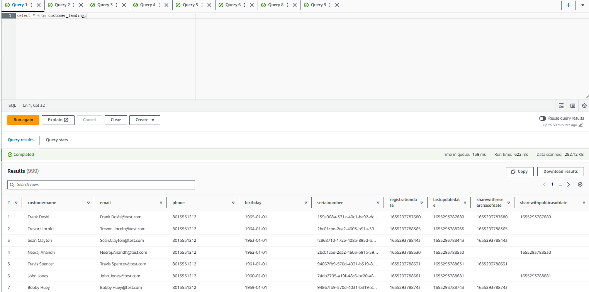
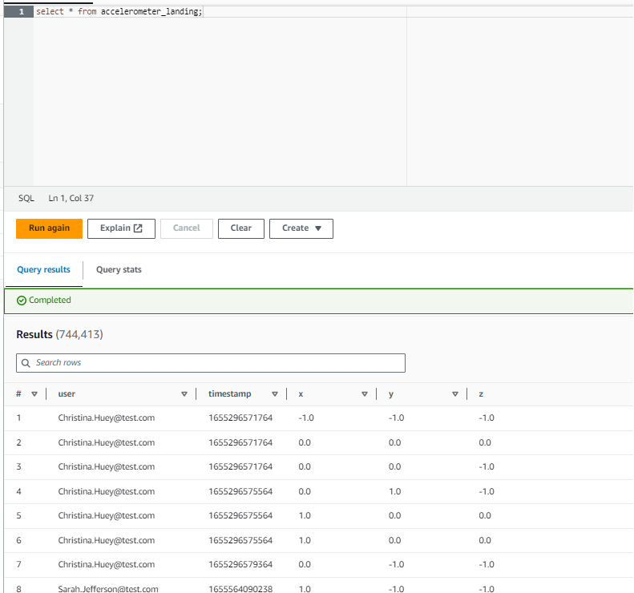
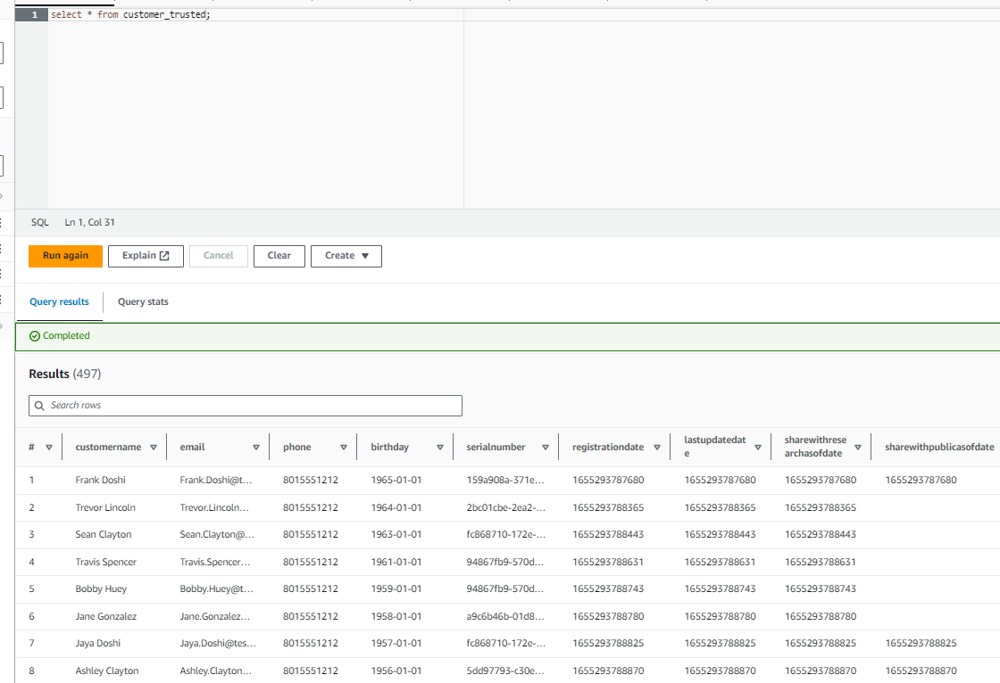
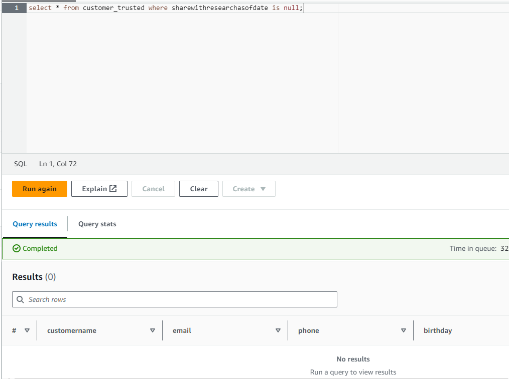

# Project: STEDI Human Balance Analytics

In this project I created a data lakehouse for sensor data that trains a machine learning model.

My goal was to extract the data produced by the STEDI step trainer sensors and the mobile app, and to curate them into a data lakehouse solution on AWS.

The datasets I worked with are:
- Customer records
- Step trainer records
- Accelerometer records

## Creating the landing zones
- I created two Glue tables, one for each landing zone. See customer_landing.sql and accelerometer_landing.sql.
- I queried each table to verify  the results.

## Sanitizing the data

- I created a glue job to remove the data of customers who didn't agree to share their data for research purposes. The resulting glue table is called customer_trusted.
- I created a glue job to remove data from accelerometer_landing belonging to customers who did not agree to share their data for research purposes. The resulting glue table is called accelerometer_trusted. 
- For the corresponding glue jobs, see customer_landing_to_trusted.py and accelerometer_landing_to_trusted.py.

## Curating the data

- Using a Glue job, I created a Glue table called customer_curated that only includes data from customers who agreed to share their data for research purposes AND who have accelerometer data.
For the corresponding Glue job, see customer_trusted_to_curated.py.

- Using a Glue job, I created a table called step_trainer_trusted that contains step trainer records of users who have accelerometer data and who have agreed to share their data for research purposes.
For the corresponding Glue job, see trainer_landing_to_trusted.py.

- Finally, I created a Glue job that joins the step trainer data with the accelerometer data, for users who have both step trainer and accelerometer data, and who have agreed to share their data for research purposes. The data was joined based on matching timestamps.
For the corresponding Glue job, see trainer_landing_to_machinelearning_curated.py.

